# Architecture Diagrams

This document contains visual architecture and runtime diagrams for the Swiss Market Dashboard.

The diagrams focus on system structure, request flow, shared cached data providers, public API behavior, security boundaries, and operational verification.

---

## System Context

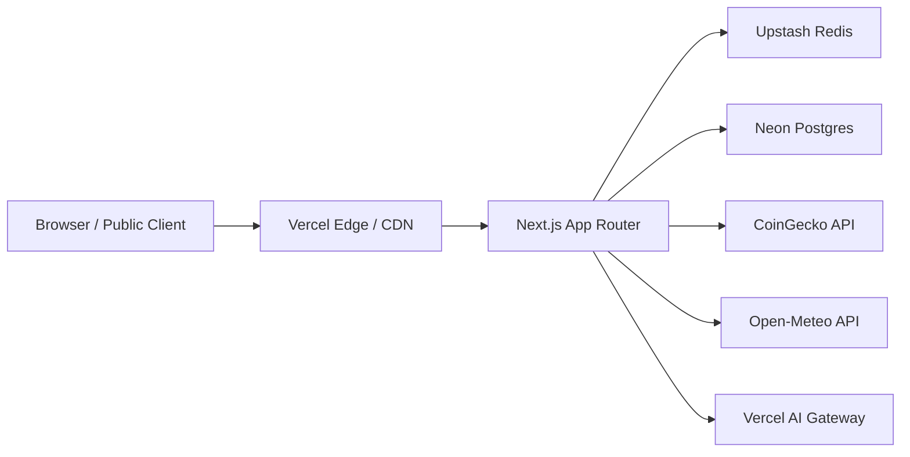

The application exposes public dashboard pages and selected public API routes. External provider access and secret handling remain server-side.

---

## Container Overview

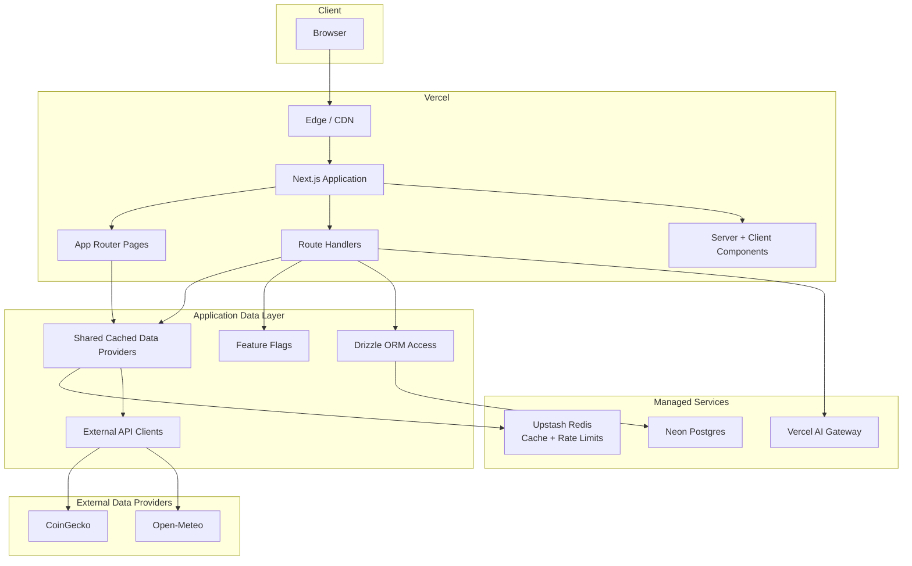

Main responsibilities:

```txt
Pages                  render dashboard views
Route handlers         expose public JSON APIs and AI-ready server route
Cached providers       centralize Redis-backed market and weather data access
Redis                  stores cache entries and rate-limit state
Neon Postgres          stores persistent market insights
Feature flags          control optional and cost-sensitive behavior
External API clients   isolate provider-specific request and response handling
```

---

## Public Page Request Flow

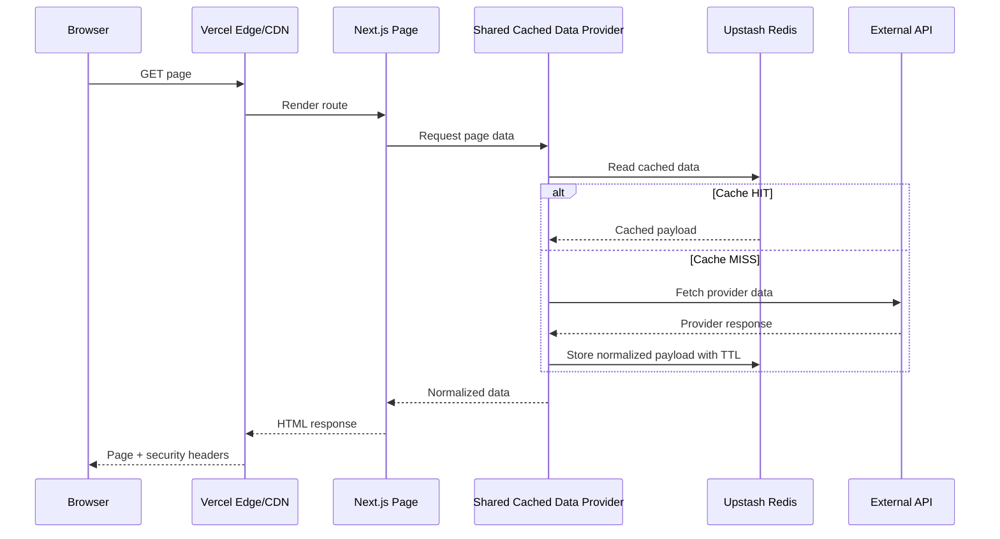

Pages and route handlers share the same cached data provider modules where applicable.

---

## Public API Request Flow

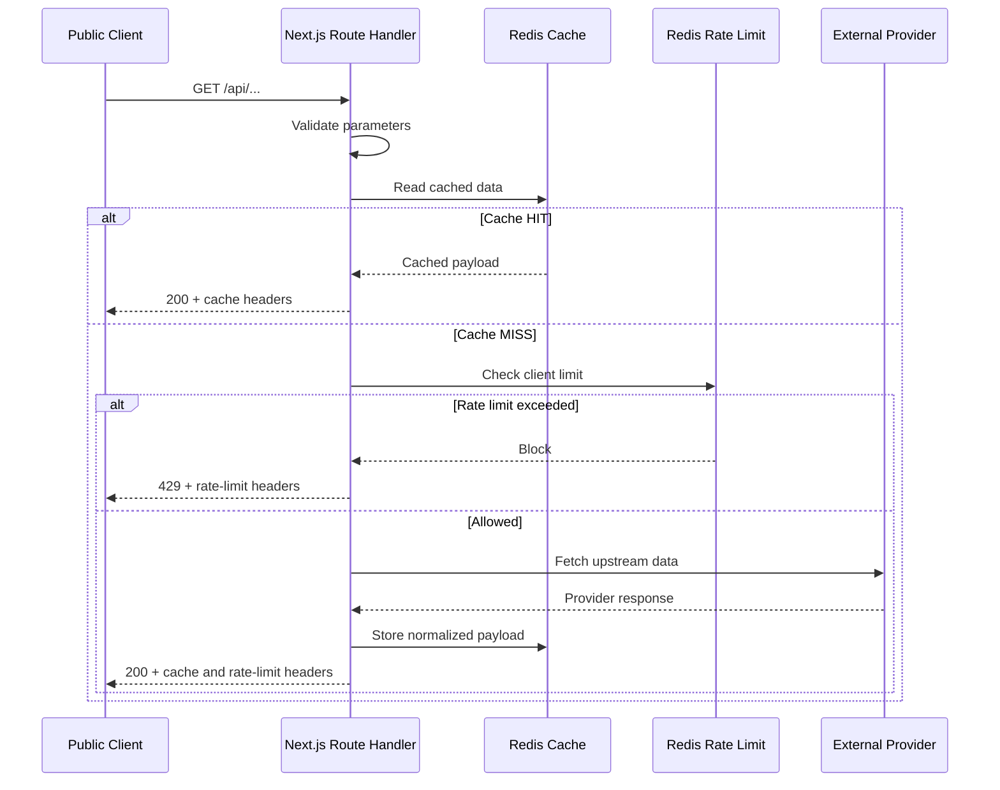

Public API routes are designed to prefer cache reuse before performing external provider calls.

---

## Shared Cached Data Provider Flow

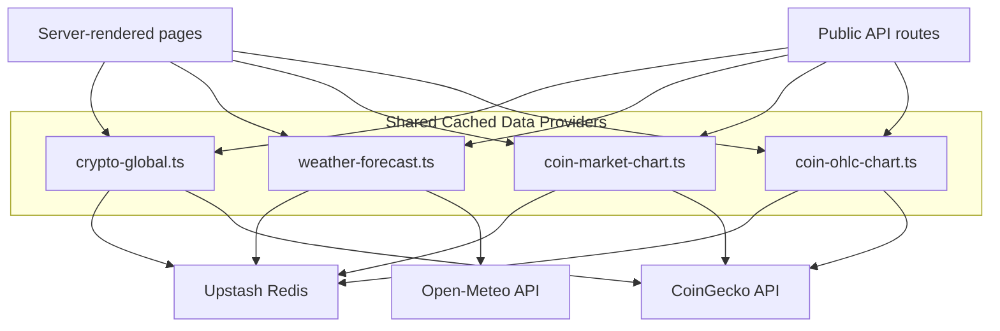

Current shared cached provider files:

```txt
src/lib/data/crypto-global.ts
src/lib/data/weather-forecast.ts
src/lib/data/coin-market-chart.ts
src/lib/data/coin-ohlc-chart.ts
```

Current cache TTLs:

```txt
Crypto global data        60 seconds
Coin market chart data    300 seconds
Coin OHLC chart data      300 seconds
Weather forecast data     1800 seconds
```

---

## Public API Observability Headers

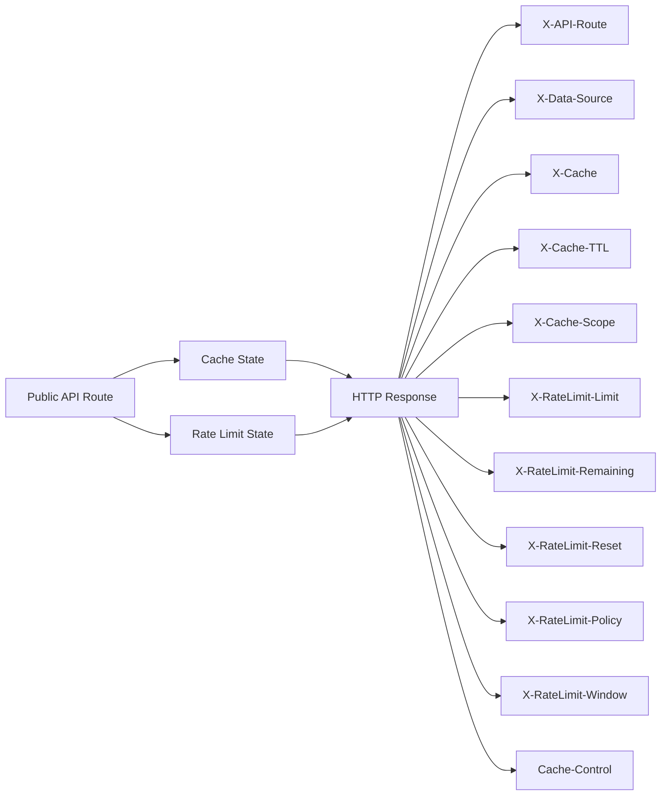

Public API headers are used for operational visibility and integration clarity.

They do not expose:

```txt
provider credentials
Redis credentials
database credentials
raw Redis keys
raw client identifiers
private infrastructure details
```

---

## Rate-Limit Flow

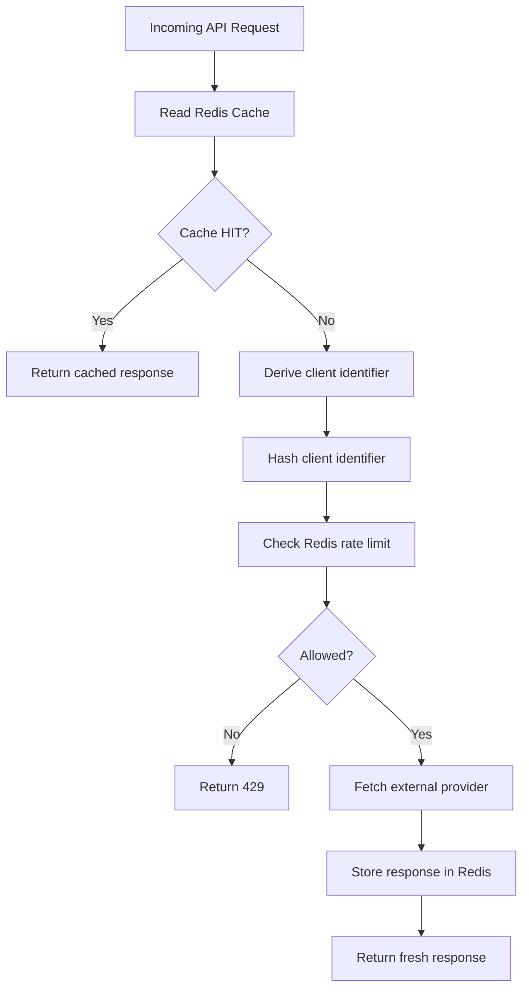

Rate limiting is applied on cache-miss paths where external provider pressure or abuse risk is relevant.

---

## AI-Ready Route Protection Flow

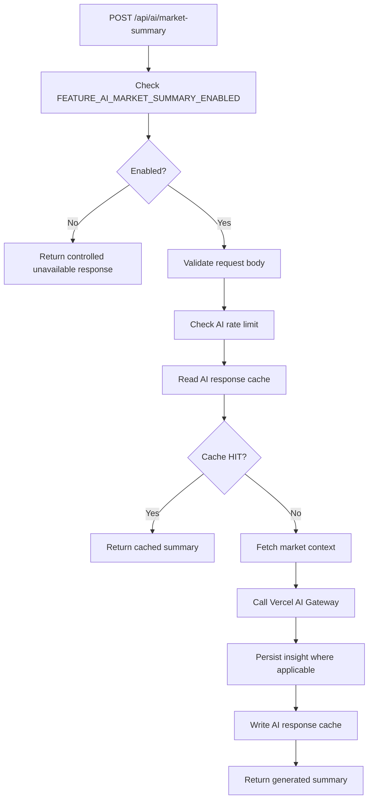

Current production state:

```env
FEATURE_AI_MARKET_SUMMARY_ENABLED=false
```

The AI path exists but is disabled in production by default to keep model execution, billing, and output behavior under explicit operational control.

---

## Market Insights Data Flow

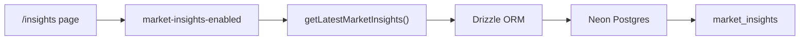

The `/insights` route reads persisted insight records through server-side data access.

---

## Security Boundary Overview

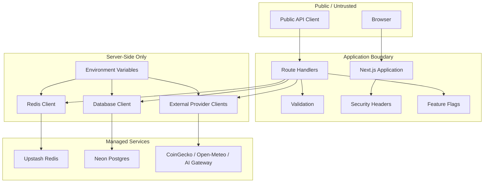

Sensitive values must remain server-side:

```txt
COINGECKO_API_KEY
DATABASE_URL
DATABASE_URL_UNPOOLED
UPSTASH_REDIS_REST_URL
UPSTASH_REDIS_REST_TOKEN
AI_GATEWAY_API_KEY
```

---

## Production Verification Flow

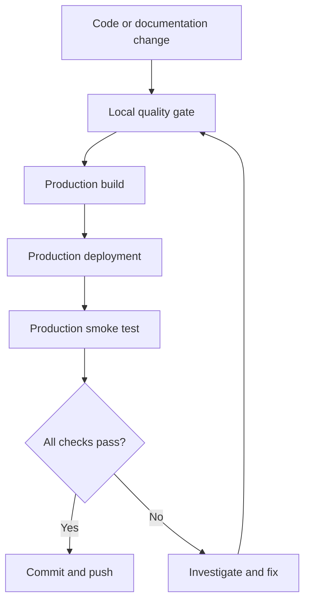

Recommended local and production verification:

```bash
pnpm type-check
pnpm lint
pnpm test:ci
pnpm build
pnpm audit
pnpm audit --prod
pnpm smoke:prod
```

Expected production smoke-test baseline:

```txt
201 checks passed
0 checks failed
```

---

## Documentation Relationships

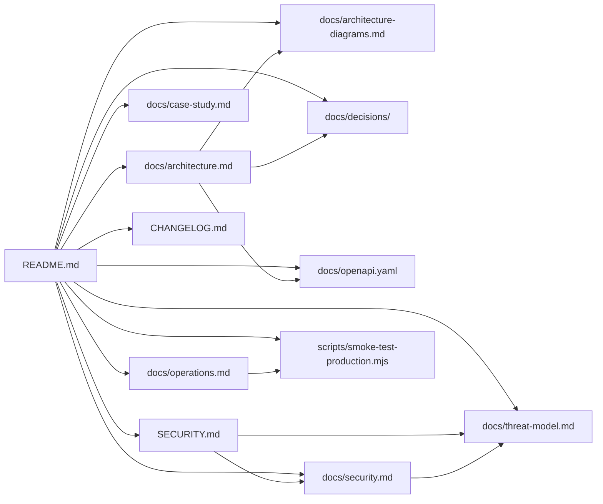

Current documentation map:

```txt
README.md                         Project overview and operational entry point
SECURITY.md                       Security policy and vulnerability reporting
docs/architecture.md              System architecture and runtime flows
docs/architecture-diagrams.md     Visual architecture and runtime diagrams
docs/decisions/                     Architecture decision records
docs/case-study.md                Engineering case study and trade-off analysis
docs/openapi.yaml                 Public API contract for market and weather endpoints
docs/operations.md                Operations runbook and production verification procedures
docs/security.md                  Technical security controls and production headers
docs/threat-model.md              Public threat model and risk overview
CHANGELOG.md                      Project change history
scripts/smoke-test-production.mjs Production smoke-test runner
```

Recommended future additions:

```txt
```

---

## Notes

The diagrams intentionally show only public and operationally relevant structure.

They do not include:

```txt
real secrets
provider tokens
database credentials
Redis credentials
private infrastructure details
```

For detailed API response schemas, use:

```txt
docs/openapi.yaml
```

For technical security controls, use:

```txt
docs/security.md
```

For security reporting, use:

```txt
SECURITY.md
```

For the public threat model, use:

```txt
docs/threat-model.md
```
