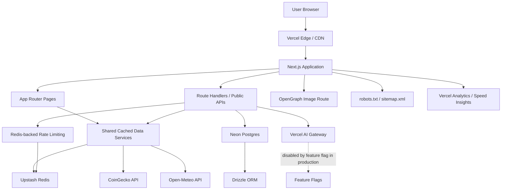
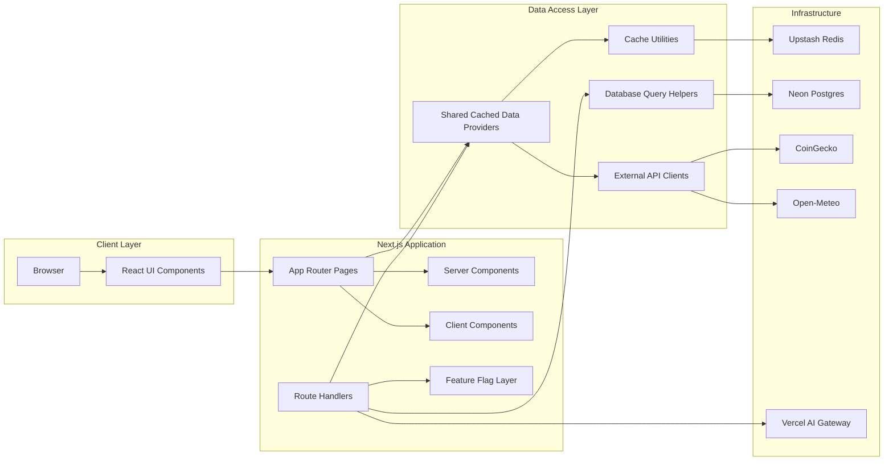
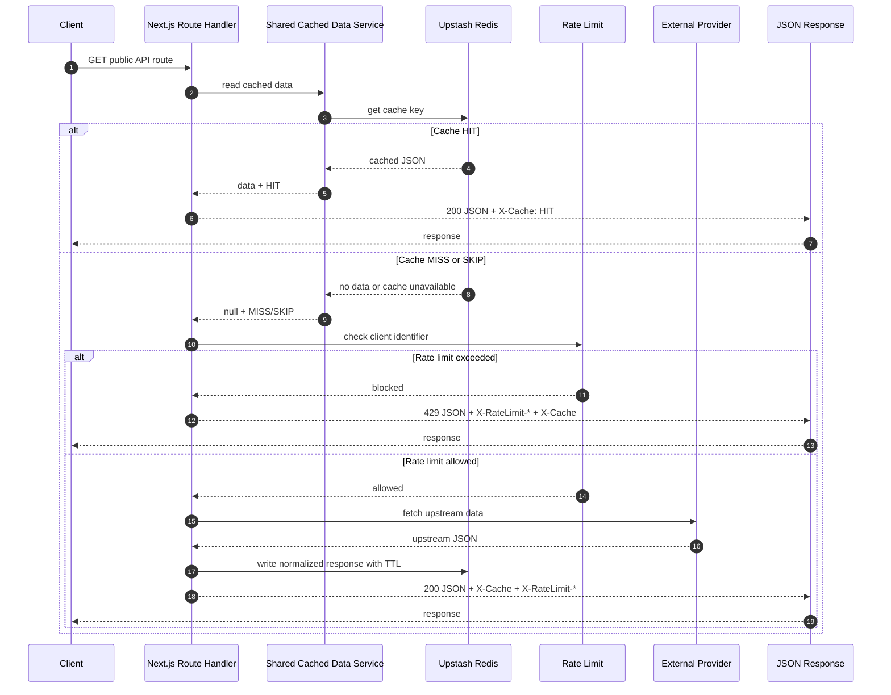
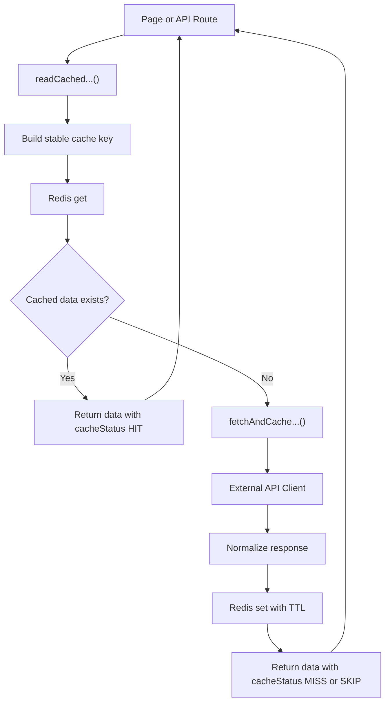
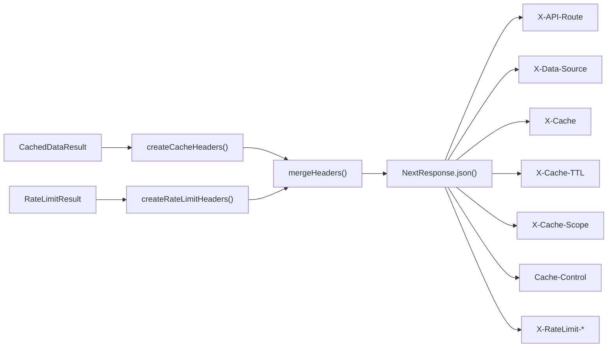
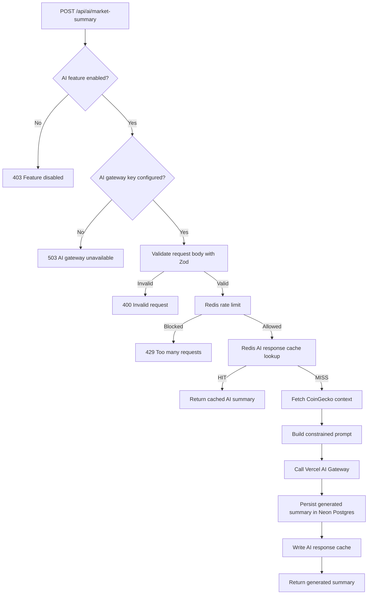
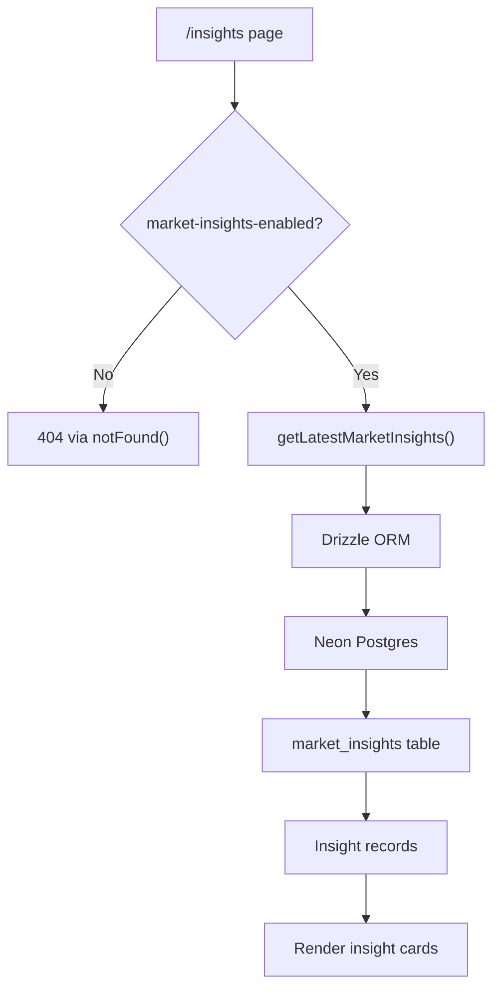
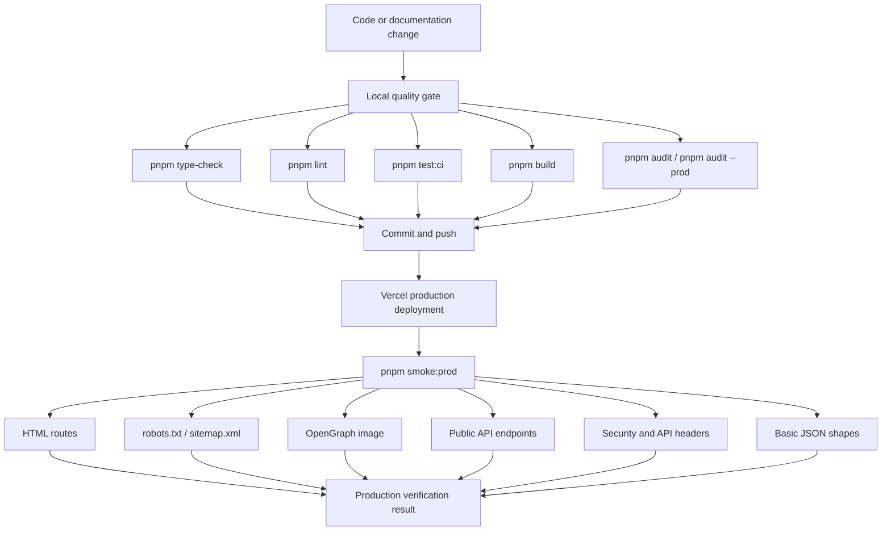
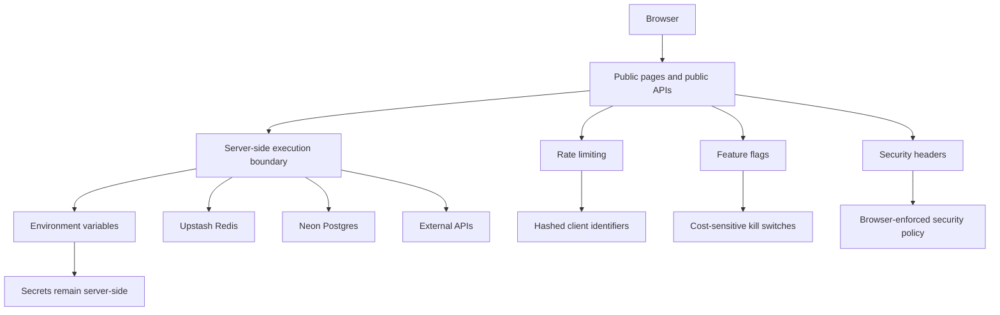
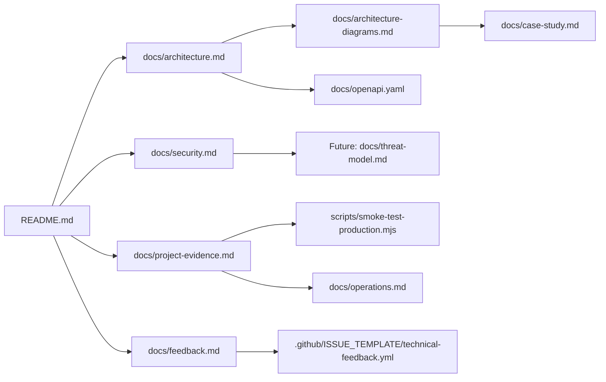

# Architecture Diagrams

This document provides visual architecture diagrams for Swiss Market Dashboard.

The diagrams are intended to make the runtime structure, data flows, cache behavior, security boundaries and production verification process easier to review.

---

## 1. System Context



Main idea:

```txt
The application is deployed on Vercel and uses server-side integrations for external APIs, Redis caching, Redis rate limiting and Postgres persistence.
```

---

## 2. Container Architecture



Container responsibilities:

```txt
Pages                  Render dashboard routes
Route Handlers         Expose public API and AI-ready server endpoints
Cached Providers       Share external data access between pages and APIs
Cache Utilities         Read/write JSON data in Redis and create cache headers
API Clients             Isolate third-party API calls
Database Queries        Encapsulate Drizzle ORM access
Feature Flags           Control rollout and cost-sensitive behavior
```

---

## 3. Public API Request Flow



Important behavior:

```txt
Cache HIT responses avoid rate-limit checks for public shared data.
MISS and SKIP responses go through rate limiting before upstream fetching.
All public API responses expose route, source, cache and cache-scope headers.
Rate-limit headers are included when the rate-limit path is evaluated.
```

---

## 4. Shared Cached Data Provider Flow



Current shared cached providers:

```txt
src/lib/data/crypto-global.ts
src/lib/data/weather-forecast.ts
src/lib/data/coin-market-chart.ts
src/lib/data/coin-ohlc-chart.ts
```

Current cache key pattern:

```txt
public-api:{domain}:{resource}:{identifier}:{window}:v1
```

Examples:

```txt
public-api:crypto:global:v1
public-api:weather:zurich:v1
public-api:crypto:market-chart:bitcoin:7:v1
public-api:crypto:ohlc:bitcoin:7:v1
```

---

## 5. Cache and Rate-Limit Header Flow



Public API observability headers:

```txt
X-API-Route
X-Data-Source
X-Cache
X-Cache-TTL
X-Cache-Scope
X-RateLimit-Limit
X-RateLimit-Remaining
X-RateLimit-Reset
X-RateLimit-Policy
X-RateLimit-Window
Cache-Control
```

Design goal:

```txt
Runtime behavior should be externally verifiable without exposing secrets, raw client identifiers or internal credentials.
```

---

## 6. AI-Ready Route Protection Flow



Current production state:

```env
FEATURE_AI_MARKET_SUMMARY_ENABLED=false
```

Reason:

```txt
AI execution is cost-sensitive and remains behind a server-side kill switch until provider billing, usage limits and operational controls are deliberately configured.
```

---

## 7. Database Flow for Market Insights



Primary table purpose:

```txt
Persistent market insight archive
Manual seeded records
Prepared storage path for future AI-generated summaries
```

---

## 8. Production Verification Flow



Current production smoke-test scope:

```txt
201 checks
0 expected failures
```

Smoke test script:

```txt
scripts/smoke-test-production.mjs
```

---

## 9. Security Boundary Overview



Protected concerns:

```txt
API keys
Database URLs
Redis credentials
AI gateway credentials
Raw client identifiers
Cost-sensitive AI execution
```

Production controls:

```txt
CSP
HSTS
X-Frame-Options
X-Content-Type-Options
Permissions-Policy
Rate limiting
Feature flags
No X-Powered-By header
Production smoke test verification
```

---

## 10. Documentation Relationship



Documentation intent:

```txt
README.md provides the entry point.
docs/architecture.md explains the system structure.
docs/architecture-diagrams.md visualizes the runtime model.
docs/security.md documents security controls.
docs/project-evidence.md records objective verification points.
docs/feedback.md defines useful public technical feedback.
```